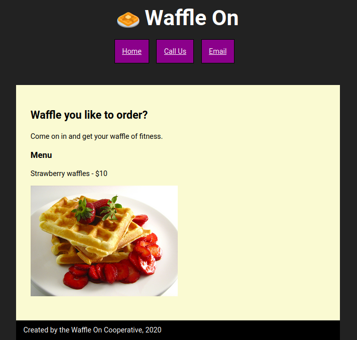
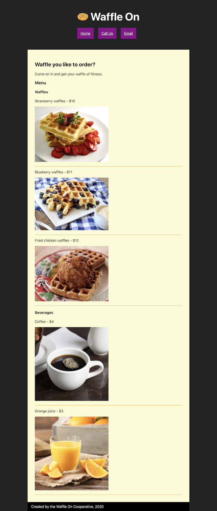
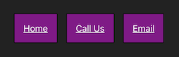
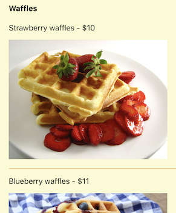
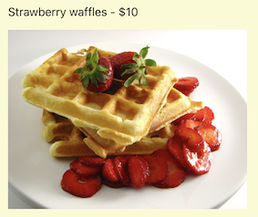
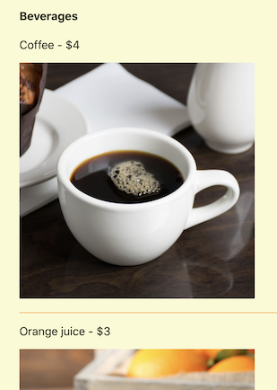

# 01 Exercise - Waffle On in React

[Refactor](https://en.wikipedia.org/wiki/Code_refactoring) an existing static React page to use [React Components, props](https://reactjs.org/docs/components-and-props.html) and [children](https://reactjs.org/docs/react-api.html#reactchildren).

---

## Brief



For this exercise, we will be taking an existing React application, and refactoring it to use React components, properties, and children.

We will be making full use of React Components to end up with a React application that has re-usable components, is easy to read, and flexible to changes.

<details>
  <summary>Complete page design</summary>
<br>



</details>

## Rationale

Thinking in components is a critical foundation for understanding React. In this exercise, you will understand how to render a React app to a webpage, and how to build custom React components.

---

## Getting Started

1. `clone` to your local computer.

There is a Git CLI Refresher at the bottom of the page.

**Important:** This code for this exercise goes in `src/index.js`

---

## Exercise Part A - Setup your React development environment

<details>
<summary>Setup your React development environment</summary>
<br>

For this exercise, We will start by getting our React development environment set up, and then we will build our first React Component.

For today's exercise, we have already provided you with a React development environment.

To start the development server, navigate to the root folder of this exercise via your terminal. You can do this by opening the terminal in VS Code, or Github Desktop. Once you have the terminal ready, type the following commands:

```shell
# install the server dependencies
npm install

# start the webserver
npm start
```

Once the server starts running it should automatically open your browser to the following site: [http://localhost:3000](http://localhost:3000)

If everything has worked properly, you should see a restaurant website selling Waffles.

**Acceptance criteria**

- If you visit http://localhost:3000 in your web browser, you can view the _Waffle On_ website
- The page matches the _Complete Page Design_ in the brief

</details>

## Exercise Part B - Create a lot of React Components

<details>
<summary>Create a lot of React Components</summary>
<br>

**Important:** Commit your changes to git each time you create a new component. Push your code to Github when you have finished this part of the exercise.

For this part of the exercise, we are going to refactor `src/index.js` to use React components.

1. Open `src/index.js` in VS Code.
2. Before we write any code, you need to understand what already exists in this file
   1. What React Component is being rendered to the DOM?
   2. What DOM element is the component being rendered into?
   3. What is the React Component returning?
   4. How is the HTML written in the React Component?
3. Now we have our bearings, lets start by breaking up the HTML into components.

### `Logo` component


We will start by creating a Logo component.

1. Underneath the comment near the top of the file `// Part B Exercise code below`, declare a new React Component called `Logo`
1. Make a `const` named `Logo`, assign it a function that returns nothing

   ```jsx
   const Logo = () => {
      return ();
   };
   ```

1. Now lets copy and paste the logo `<h1>🧇 Waffle On</h1>` from the main `Homepage` component. You should paste this into the `return` statement inside the `Logo` component. Your code will look like this:

   ```jsx
   const Logo = () => {
     return <h1>🧇 Waffle On</h1>;
   };
   ```

1. We have now declared a new React Component, but we are not using it. Replace the original code inside the `Homepage` component with our new `Logo` component. Your code should look like this:

   ```js
   <div class="container">
      <Logo />
      <ul class="nav-menu">
      <li class="nav-item">
         <a href="#" class="nav-link">Home</a>
      </li>
      /// rest of the code
   </div>
   ```

1. Go to [http://localhost:3000](http://localhost:3000). Everything should look the same! We have successfully refactored our first React component. Let's continue with the rest of the code. Do not forget to `commit` your new React component to `git`.

### `NavMenu` component



1. Create a new React Component named `NavMenu`, and replace the existing `<ul class="nav-menu">...</ul>` code with your new React Component. Follow the steps above to accomplish this, but replacing the existing `NavMenu` list instead.
2. Go to [http://localhost:3000](http://localhost:3000). Again, everything should look the same!

### `WafflesMenu` component



Let's continue making React Components. We will now make our Menu items into React Components, breaking things down into sub-components.

1. In the next step we will force an error: Create a new React Component called `WafflesMenu`, underneath the `NavMenu` component. We will copy and paste the entire Waffles menu, including the heading, into this React Component. Your component should end up looking like this:

   ```js
   const WafflesMenu = () => {
      return (
         <h4>Waffles</h4>
         <ul>
            <li>
               <p>Strawberry waffles - $10</p>
               <p>
                  
               </p>
            </li>
            <li>
               <p>Blueberry waffles - $11</p>
               <p>
                  
               </p>
            </li>
            <li>
               <p>Fried chicken waffles - $12</p>
               <p>
                  
               </p>
            </li>
         </ul>
      );
   }
   ```

2. Save your file, and watch the terminal. You have gotten an error! Can you spot what the problem is?
3. Fix the problem by wrapping the `JSX` inside `WafflesMenu` with a `<>` tag (this is called a [fragment](https://reactjs.org/docs/fragments.html)). React will not allow us to have multiple adjacent elements, so we need to wrap it in a single element. It should look similar to the following, however, the list items are removed to illustrate the change clearly

   ```js
   const WafflesMenu = () => {
     return (
       <>
         <h4>Waffles</h4>
         <ul>// ...the waffle list items should be here</ul>
       </>
     );
   };
   ```

4. We now need to reference this new component in our main `Homepage` component. Replace the code you have copied with the React Component. It should end up looking similar to the following:

   ```js
   <h3>Menu</h3>
   <WafflesMenu />

   <h4>Beverages</h4>
   ```

5. Go to [http://localhost:3000](http://localhost:3000). Again, everything should look the same!

### `MenuItem` components



We now have a `WafflesMenu` component, but let's break that down further. We will make each of the list items their own component.

1. Create a new React Component named `StrawberryWaffleMenuItem`, and make it return the first list item from `MenuItem`. It should look something like this:

   ```js
   const StrawberryWaffleMenuItem = () => {
     return (
       <li>
         <p>Strawberry waffles - $10</p>
         <p>
           
         </p>
       </li>
     );
   };
   ```

2. Replace the list item inside `WafflesMenu` with this new React Component. Your `WafflesMenu` component should now look like this:

   ```js
   const WafflesMenu = () => {
     return (
       <>
         <h4>Waffles</h4>
         <ul>
           <StrawberryWaffleMenuItem />
           <li>
             <p>Blueberry waffles - $11</p>
             <p>
               
             </p>
           </li>
           <li>
             <p>Fried chicken waffles - $12</p>
             <p>
               
             </p>
           </li>
         </ul>
       </>
     );
   };
   ```

3. Go to [http://localhost:3000](http://localhost:3000). Again, everything should look the same.
4. Repeat the above steps with the remaining two list items. You should end up with a `WafflesMenu` component that looks like this:

   ```js
   const WafflesMenu = () => {
     return (
       <>
         <h4>Waffles</h4>
         <ul>
           <StrawberryWaffleMenuItem />
           <BlueberryWaffleMenuItem />
           <FriedChickenWaffleMenuItem />
         </ul>
       </>
     );
   };
   ```

5. Ensure everything is working by visiting your app at [http://localhost:3000](http://localhost:3000). Again, everything should look the same.

### `BeveragesMenu` component



See if you can follow the previous steps to create a new component named `BeveragesMenu`. Also, follow the steps to create individual `XXMenuItem` components for each of the beverages

When you are finished, your `Homepage` component should look like this:

```js
function Homepage() {
  return (
    <div class="container">
      <Logo />
      <NavMenu />
      <article class="homepage">
        <h2>Waffle you like to order?</h2>
        <p>Come on in and get your waffle of fitness.</p>

        <h3>Menu</h3>
        <WafflesMenu />
        <BeveragesMenu />
      </article>

      <footer class="footer">Created by the Waffle On Cooperative, 2020</footer>
    </div>
  );
}
```

Ensure everything is working by visiting your app at [http://localhost:3000](http://localhost:3000). Again, everything should look the same.

🎉Congratulations🎉, you have refactored your React app to use a lot of components :)

**Important!!** At this point, commit the code you have written, and push it to GitHub. This will make it easy to review your code, and provides a safe point to come back to if you get stuck on the next steps.

**Acceptance criteria**

- If you visit http://localhost:3000 in your web browser, you can view the _Waffle On_ website
- The page matches the _Complete Page Design_ in the brief
- Your React app has the following components:
  - `Logo`
  - `NavMenu`
  - `WafflesMenu`
  - `StrawberryWaffleMenuItem`
  - `BlueberryWaffleMenuItem`
  - `FriedChickenWaffleMenuItem`
  - `BeveragesMenu`
  - A component for each beverage

</details>

## Exercise Part C - Use React component props

<details>
<summary>Use React component props</summary>
<br>

Now we have everything as a component, we can start to identify a lot of repetition. In particular, we have 5 `<XXMenuItem>` components, that all have a very similar structure.

We can reduce a lot of repetition by using the `props` functionality in React. You can think of `props` as function parameters for your UI.

Read the React documentation for [Components and Props](https://reactjs.org/docs/components-and-props.html) to get an idea of what we will be doing in this part of the exercise.

We will start by creating a generic `<MenuItem />` component, passing in props, and then continue to refactor all our existing `MenuItem`'s to use the generic component.


1. Create a new React Component named `MenuItem`, and have it return the contents of an existing menu item. Your code should look something like this:

   ```js
   const MenuItem = () => {
     return (
       <li>
         <p>Strawberry waffles - $10</p>
         <p>
           
         </p>
       </li>
     );
   };
   ```

2. First, we need to identify what parts of this component are dynamic, and which parts will stay the same. We can tell there is a `title`, `price`, and `image alt` tag. Let's make it so we can pass these in dynamically.

3. Update your `MenuItem` component to accept a `props` parameter, and write it to the console, so we can understand how it works. Note: `console.log` will only start writing to the browser console once we have called the MenuItem.

   ```js
   const MenuItem = (props) => {
     console.log(props);
     return (
       <li>
         <p>Strawberry waffles - $10</p>
         <p>
           
         </p>
       </li>
     );
   };
   ```

4. Now we can call our new React Component from `WafflesMenu`. To use React props, you can supply additional attributes to your element in `JSX`. React will automatically pass them through in the props parameter.
5. Update `WafflesMenu` to call the new `MenuItem`, and pass it in `props`. Your `WafflesMenu` code should look like the following:

   ```js
   const WafflesMenu = () => {
     return (
       <>
         <h4>Waffles</h4>
         <ul>
           <MenuItem
             title="Strawberry Waffles"
             price="$10"
             imgSrc="/waffles-strawberry.jpg"
           />
           <BlueberryWaffleMenuItem />
           <FriedChickenWaffleMenuItem />
         </ul>
       </>
     );
   };
   ```

6. Open your browser and go to [http://localhost:3000](http://localhost:3000). Inspect your browser console to see what the `props` object looks like. Notice how it is an object, that has the `title`, `price` and `imgSrc` props we added to the `<MenuItem />` component

   

7. Let's use these properties in our `MenuItem` component. `JSX` has a special syntax for allowing you to put dynamic variables in your `JSX`. To do this, you should wrap your variables in curly brackets. This instructs `JSX` to read the dynamic properties, similar to the curly brackets we use in string templates.
8. Update your `<MenuItem>` component to look like this:

   ```js
   const MenuItem = (props) => {
     return (
       <li>
         <p>
           {props.title} - {props.price}
         </p>
         <p>
           
         </p>
       </li>
     );
   };
   ```

9. Open your browser at [http://localhost:3000](http://localhost:3000). You `<MenuItem />` component should be working correctly, and displaying the Strawberry Waffle as it has always been displayed!
10. We can make one more improvement to our `<MenuItem>` component. At the moment we are repeating `props.` a lot in our code. We can use object destructuring here to make the code more concise. Update the menu item to be the following:

    ```js
    const MenuItem = ({ title, price, imgSrc }) => {
      return (
        <li>
          <p>
            {title} - {price}
          </p>
          <p>
            
          </p>
        </li>
      );
    };
    ```

11. Nothing should have changed on your Waffle Restaurant website.
12. At this point, we have a component that can be re-used for all our menu items.
13. In both `<WafflesMenu />` and `<BeveragesMenu />`, replace all of the existing components with our new `<MenuItem />` component, being careful to pass in the right properties. As an example, your `<WafflesMenu>` component should now look like this:

    ```js
    const WafflesMenu = () => {
      return (
        <>
          <h4>Waffles</h4>
          <ul>
            <MenuItem
              title="Strawberry Waffles"
              price="$10"
              imgSrc="/waffles-strawberry.jpg"
            />
            <MenuItem
              title="Blueberry waffles"
              price="$10"
              imgSrc="/waffles-blueberry.jpg"
            />
            <MenuItem
              title="Fried chicken waffles"
              price="$12"
              imgSrc="/waffles-chicken.jpg"
            />
          </ul>
        </>
      );
    };
    ```

14. Once you have finished refactoring your `<MenuItem>` components, check your page is still working. You can now delete all the previous components from your file.


🎉Congratulations🎉, you have just refactored your React Components to use `props`, which enables you to make your components `re-usable` and `dynamic`.

**Important!!** At this point, commit the code you have written, and push it to GitHub. This will make it easy to review your code, and provides a safe point to come back to if you get stuck on the next steps.

**Acceptance criteria**

- If you visit http://localhost:3000 in your web browser, you can view the _Waffle On_ website
- The page matches the _Complete Page Design_ in the brief
- Each of the waffle and beverage menu items uses the same `<MenuItem>` component

</details>

## Exercise Part D - Component composition

<details>
<summary>Component composition</summary>
<br>

Our app is looking pretty good now, however, there are still some improvements we could make to reduce repetition.

If we revisit our `Homepage` component, you might notice we have two menu's, which have a similar structure:

- Both have headings
- Both have a bunch of menu items

We can remove this repetition, and make use of React's ability to compose components together.

Read the React Documentation for [Composition vs Inheritance](https://reactjs.org/docs/composition-vs-inheritance.html) to get an overview of what we will be doing.


1. Let's start by making a new component named `<Menu>`. We can copy the contents of the `<WaffleMenu>` to get us started. Your component should look like this:

   ```js
   const Menu = () => {
     return (
       <>
         <h4>Waffles</h4>
         <ul>
           <MenuItem
             title="Strawberry Waffles"
             price="$10"
             imgSrc="/waffles-strawberry.jpg"
           />
           <MenuItem
             title="Blueberry waffles"
             price="$10"
             imgSrc="/waffles-blueberry.jpg"
           />
           <MenuItem
             title="Fried chicken waffles"
             price="$12"
             imgSrc="/waffles-chicken.jpg"
           />
         </ul>
       </>
     );
   };
   ```

2. Let's pass in the title as a `prop`, like we did for the previous `<MenuItem>` components:

   ```js
   const Menu = ({ title }) => {
     return (
       <>
         <h4>{title}</h4>
         <ul>
           <MenuItem
             title="Strawberry Waffles"
             price="$10"
             imgSrc="/waffles-strawberry.jpg"
           />
           <MenuItem
             title="Blueberry waffles"
             price="$10"
             imgSrc="/waffles-blueberry.jpg"
           />
           <MenuItem
             title="Fried chicken waffles"
             price="$12"
             imgSrc="/waffles-chicken.jpg"
           />
         </ul>
       </>
     );
   };
   ```

3. Update the `Homepage` component to use the new `Menu` component. It will look similar to this:

   ```jsx
   <h3>Menu</h3>
   <Menu title="Waffles" />
   <BeveragesMenu />
   ```

4. If you open [http://localhost:3000](http://localhost:3000), everything should look the same.
5. Now, what about the `<MenuItem>` components? It's not very useful to pass in all the properties to the `props` needed to render these. To solve this problem, React has a special property called `children`. We can use this property to pass in the `MenuItems`.
6. In the `Homepage` component, we can change the way we are using `Menu` to have children. Change the existing `<Menu>` component to be the following:

   ```jsx
   <Menu title="Waffles">
     <MenuItem
       title="Strawberry Waffles"
       price="$10"
       imgSrc="/waffles-strawberry.jpg"
     />
     <MenuItem
       title="Blueberry waffles"
       price="$10"
       imgSrc="/waffles-blueberry.jpg"
     />
     <MenuItem
       title="Fried chicken waffles"
       price="$12"
       imgSrc="/waffles-chicken.jpg"
     />
   </Menu>
   ```

7. You can see here, instead of using a self-closing tag, we are opening and closing the `<Menu>` component. In between the opening and closing `Menu` tag, we are declaring our `<MenuItem>` components. React will pass in these components automatically on the `children` property.
8. Let's render these children to our page. Find your `Menu` component in your code. Change the `Menu` component to be the following:

   ```jsx
   const Menu = ({ title, children }) => {
     return (
       <>
         <h4>{title}</h4>
         <ul>{children}</ul>
       </>
     );
   };
   ```

9. Notice how we are reading the `children` property from the `props` object when our `Menu` component is called. We then use the `JSX` syntax to render the `children` variable.
10. If you open [http://localhost:3000](http://localhost:3000), everything should look the same.
11. Take some time now to go back over what we have done. Re-read the code, and follow through how it works.
12. Now we have a re-usable `Menu` component. Replace the existing `BeveragesMenu` with the new `Menu` component, copying the pattern we used for the waffles.


13. Delete all your unused variables. You should be left with the following components: `Logo`, `NavMenu`, `MenuItem`, `Menu`, and `Homepage`
14. When you are finished, ensure it works by visiting [http://localhost:3000](http://localhost:3000)

You have now refactored your React app to compose components together to avoid repetition and make your codebase much more flexible. Think back to how the code looks when you started, and how it looks now.

**Important!!** At this point, commit the code you have written, and push it to GitHub. This will make it easy to review your code, and provides a safe point to come back to if you get stuck on the next steps.

**Acceptance criteria**

- If you visit http://localhost:3000 in your web browser, you can view the _Waffle On_ website
- The page matches the _Complete Page Design_ in the brief
- Your React app should only contain the following components:
  - `Logo`,
  - `NavMenu`,
  - `MenuItem`,
  - `Menu`
  - `Homepage`

</details>

---

# Submit your Exercise

- [ ] Code is pushed to GitHub

**Note** There are no automated tests in GitHub for this exercise
